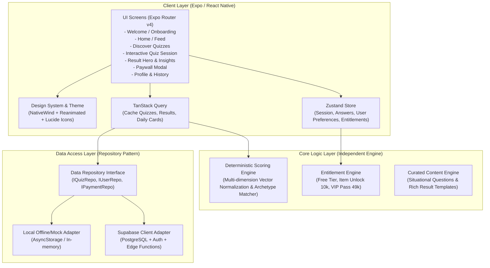

# Kế Hoạch Triển Khai Kiến Trúc Ứng Dụng Di Động: “Nè Bạn Ơi” (MVP)

---

## 1. Goal Description (Mục tiêu dự án)

Xây dựng ứng dụng di động **“Nè Bạn Ơi”** - một sản phẩm mobile app tiếng Việt định hướng Gen Z và người trẻ (18–28 tuổi), tập trung vào các bài trắc nghiệm tình yêu, khám phá tính cách, thấu hiểu bản thân và nội dung tương tác hằng ngày.

### Định vị cốt lõi & Nguyên tắc sản phẩm:
1. **Không phải app chiêm tinh/tử vi thuần túy**: Không dán nhãn bói toán huyền bí, mà lấy tâm lý học tình yêu thực tế kết hợp tình huống gần gũi làm trọng tâm.
2. **Không phải AI Chatbot thông thường**: Không dùng AI để sinh nội dung bừa bãi hay câu hỏi vô thưởng vô phạt. Nội dung và câu hỏi được kiểm soát 100% về chất lượng, ngôn phong Gen Z Việt Nam tự nhiên, hóm hỉnh và thấu cảm.
3. **Logic tính điểm & Profile tất định (Deterministic & Data-driven)**: Thuật toán chấm điểm theo vector đa chiều (Dimensions scoring engine), không phụ thuộc vào AI blackbox.
4. **AI sinh ảnh là module tương lai**: Chuẩn bị sẵn kiến trúc dữ liệu và UI placeholder/locked preview cho tính năng "Ảnh người thương tương lai / Ảnh vibe couple".
5. **Giao diện Dreamy Pastel Aesthetic**: Tone hồng phấn, tím lavender, kem sữa, góc bo tròn mềm mại, chuyển động mượt mà, cảm giác ngọt ngào, ấm áp nhưng vẫn chuẩn chỉ như một sản phẩm thương mại cao cấp.
6. **Sẵn sàng thương mại hóa (Monetization-ready)**: Hỗ trợ mở khóa lẻ từng kết quả (10.000đ) hoặc thẻ VIP Pass toàn bộ (49.000đ) qua kiến trúc Entitlement module.

---

## 2. User Review Required (Những điểm cần chốt với User)

> [!IMPORTANT]
> **Cấu trúc Monorepo vs Standalone Mobile Project:**
> Đề xuất tạo cấu trúc monorepo gọn nhẹ chuẩn pnpm workspace hoặc cấu trúc module hóa trực tiếp trong `apps/mobile` (với các thư mục tách biệt: `packages/scoring`, `packages/content-seeds`, `packages/types`). 
> Phương án khuyến nghị là **Standalone Clean Modular App** (Expo Router SDK 52 + TypeScript) có các module `src/features/scoring`, `src/features/quiz`, `src/features/paywall`, `src/content`, giúp giảm độ phức tạp của tooling monorepo trên Windows trong khi vẫn đảm bảo 100% tính tách bạch logic.

> [!NOTE]
> **Chiến lược Mock Data & Supabase:**
> Để việc phát triển nhanh và chạy được ngay lập tức trên máy (Expo Go / Web preview / Emulator) mà không bị phụ thuộc vào việc phải cấu hình kết nối mạng Supabase ngay từ phút đầu, chúng ta sẽ xây dựng tầng **Repository Pattern (`QuizRepository`, `UserRepository`, `EntitlementRepository`)**. Mặc định sử dụng **Local Memory/AsyncStorage Provider** với đầy đủ dữ liệu mồi cực chất (Seeded Content), sau đó chỉ cần cấu hình biến môi trường Supabase là có thể chuyển đổi mượt mà sang **Supabase Provider**.

---

## 3. Tech Stack & Architecture Overview



### Các công nghệ chỉ định:
- **Mobile Framework**: React Native + Expo (Expo SDK 52+, Expo Router v4).
- **Styling**: NativeWind (Tailwind CSS v3/v4 for React Native) kết hợp bộ token màu sắc pastel tùy biến.
- **Micro-interactions**: `react-native-reanimated` (chuyển động mượt mà của thẻ bài, thanh tiến trình, hiệu ứng lấp lánh).
- **Iconography**: `lucide-react-native` và custom SVG accents (trái tim, ngôi sao, vương miện pastel).
- **State Management**:
  - `zustand` + `persist` cho UI state, tiến trình bài trắc nghiệm, và danh sách quyền sở hữu (Entitlements).
  - `@tanstack/react-query` cho server state, fetching bài trắc nghiệm và lịch sử kết quả.
- **Backend / DB**:
  - Supabase (PostgreSQL, Row Level Security, Edge Functions cho scoring server-side).
  - Tầng dữ liệu thiết kế theo Repository Pattern: có sẵn Local In-Memory Provider để test ngay lập tức và Supabase Provider để chạy production.
- **Analytics & Crash Monitoring**:
  - PostHog (Tracking funnel: xem bài trắc nghiệm -> hoàn thành -> xem kết quả -> bấm thẻ khóa -> mở paywall -> mua thành công).
  - Sentry (Crash logging).

---

## 4. Visual Design System (“Dreamy Pastel” Aesthetic)

Bộ màu sắc và thông số giao diện được thiết kế độc quyền cho **“Nè Bạn Ơi”**:

### Color Palette (Mã màu chính thức)
- **Background Gradient**:
  - Primary Background: `#FFF7F9` (Kem hồng phấn siêu mềm)
  - Surface Card: `#FFFFFF` (Trắng tinh khôi với viền pastel vi mô)
  - Header/Accent Gradient: từ `#FFE4ED` (Soft Rose) đến `#EDE9FE` (Dreamy Lavender)
- **Primary / Brand Colors**:
  - Primary Pink: `#F472B6` (Hồng ngọt ngào, dùng cho CTA chính)
  - Primary Dark Pink: `#DB2777` (Hồng đậm cho text nhấn mạnh)
  - Lavender Accent: `#A78BFA` (Tím nhạt mộng mơ)
  - Purple Accent: `#8B5CF6` (Tím dịu dàng)
  - Peach Warmth: `#FDBA74` (Cam đào ấm áp)
- **Neutral & Typography Colors**:
  - Text Primary: `#3B1C54` (Tím than trầm sang trọng, tuyệt đối không dùng đen thuần `#000000`)
  - Text Secondary: `#7E638D` (Tím xám trung tính nhẹ)
  - Text Muted: `#AFA0BA` (Màu phụ đề, thời gian)
  - Border Subtles: `#FCE7F3` / `#F3E8FF` (Viền mờ cánh hoa)
  - Lock Gold Badge: `#F59E0B` (Vàng kim nhẹ nhàng cho thẻ VIP)

### Radii & Shadows
- **Card Border Radius**: `rounded-3xl` (24px – 28px) cho cảm giác tròn trịa, đáng yêu.
- **Button Border Radius**: `rounded-full` (9999px) hình viên nang kẹo ngọt.
- **Shadow**: Soft Pink Glow (`shadowColor: '#F472B6', shadowOpacity: 0.15, shadowRadius: 12`).

---

## 5. Database Schema & Entities (PostgreSQL / Supabase)

Thiết kế cơ sở dữ liệu quan hệ chuẩn hóa cao:

```sql
-- 1. Bảng Dimensions (Các chiều tâm lý)
CREATE TABLE dimensions (
    id VARCHAR(50) PRIMARY KEY, -- 'affection', 'playfulness', 'independence', 'sensitivity', 'caretaking', 'communication'
    name VARCHAR(100) NOT NULL, -- 'Độ ngọt ngào', 'Độ nhí nhảnh', 'Độ độc lập', 'Độ tủi thân', 'Độ chu đáo', 'Độ thẳng thắn'
    description TEXT,
    icon_name VARCHAR(50),
    created_at TIMESTAMP WITH TIME ZONE DEFAULT NOW()
);

-- 2. Bảng Quiz Types / Danh mục bài trắc nghiệm
CREATE TABLE quiz_types (
    id VARCHAR(50) PRIMARY KEY, -- 'love-style', 'green-flag', 'future-lover', 'red-flag-detector'
    title VARCHAR(200) NOT NULL,
    slug VARCHAR(100) UNIQUE NOT NULL,
    subtitle VARCHAR(255),
    description TEXT,
    cover_image_url TEXT,
    badge_tag VARCHAR(50), -- 'HOT', 'MỚI', 'TÂM ĐIỂM'
    estimated_time VARCHAR(20) DEFAULT '3 phút',
    question_count INT DEFAULT 8,
    is_active BOOLEAN DEFAULT TRUE,
    display_order INT DEFAULT 0,
    created_at TIMESTAMP WITH TIME ZONE DEFAULT NOW()
);

-- 3. Bảng Questions (Ngân hàng câu hỏi tình huống)
CREATE TABLE questions (
    id UUID PRIMARY KEY DEFAULT gen_random_uuid(),
    quiz_type_id VARCHAR(50) REFERENCES quiz_types(id) ON DELETE CASCADE,
    question_text TEXT NOT NULL,
    context_scenario TEXT, -- Gợi ý tình huống (ví dụ: '11h đêm người ấy nhắn...')
    illustration_type VARCHAR(50) DEFAULT 'love-heart',
    display_order INT NOT NULL,
    is_active BOOLEAN DEFAULT TRUE,
    created_at TIMESTAMP WITH TIME ZONE DEFAULT NOW()
);

-- 4. Bảng Question Options & Dimension Weights
CREATE TABLE question_options (
    id UUID PRIMARY KEY DEFAULT gen_random_uuid(),
    question_id UUID REFERENCES questions(id) ON DELETE CASCADE,
    option_key VARCHAR(5) NOT NULL, -- 'A', 'B', 'C', 'D'
    option_text TEXT NOT NULL,
    subtext TEXT, -- Diễn giải phụ dí dỏm
    dimension_weights JSONB NOT NULL, -- Ví dụ: {"affection": 2, "sensitivity": 1, "independence": -1}
    display_order INT NOT NULL
);

-- 5. Bảng Result Templates (Hồ sơ kết quả mẫu)
CREATE TABLE result_templates (
    id VARCHAR(100) PRIMARY KEY, -- 'archetype-em-be-ngot-ngao', 'archetype-chien-than-doc-lap'
    quiz_type_id VARCHAR(50) REFERENCES quiz_types(id) ON DELETE CASCADE,
    archetype_title VARCHAR(150) NOT NULL, -- 'Em Bé Nũng Nịu Cần Được Cưng Chiều'
    archetype_subtitle VARCHAR(255),
    vibe_tag VARCHAR(100), -- 'Hệ Nước Nhu Mì • Tinh Tế 100%'
    summary_description TEXT NOT NULL,
    free_insights JSONB NOT NULL, -- Mảng 2-3 thẻ phân tích miễn phí
    locked_premium_insights JSONB NOT NULL, -- Mảng 3-4 thẻ phân tích VIP (bị mờ/khóa)
    future_ai_portrait_prompt TEXT, -- Chuẩn bị sẵn prompt AI cho tương lai
    min_dimensions_criteria JSONB, -- Điều kiện điểm số để match profile này
    badge_icon VARCHAR(50)
);

-- 6. Bảng User Quiz Sessions & Answers
CREATE TABLE quiz_sessions (
    id UUID PRIMARY KEY DEFAULT gen_random_uuid(),
    user_id UUID, -- NULL nếu khách ẩn danh (guest session)
    quiz_type_id VARCHAR(50) REFERENCES quiz_types(id),
    status VARCHAR(20) DEFAULT 'in_progress', -- 'in_progress', 'completed'
    started_at TIMESTAMP WITH TIME ZONE DEFAULT NOW(),
    completed_at TIMESTAMP WITH TIME ZONE
);

CREATE TABLE user_answers (
    id UUID PRIMARY KEY DEFAULT gen_random_uuid(),
    session_id UUID REFERENCES quiz_sessions(id) ON DELETE CASCADE,
    question_id UUID REFERENCES questions(id),
    selected_option_id UUID REFERENCES question_options(id),
    created_at TIMESTAMP WITH TIME ZONE DEFAULT NOW()
);

-- 7. Bảng User Quiz Results
CREATE TABLE user_quiz_results (
    id UUID PRIMARY KEY DEFAULT gen_random_uuid(),
    session_id UUID REFERENCES quiz_sessions(id) ON DELETE CASCADE,
    user_id UUID,
    quiz_type_id VARCHAR(50) REFERENCES quiz_types(id),
    matched_template_id VARCHAR(100) REFERENCES result_templates(id),
    dimension_scores JSONB NOT NULL, -- {"affection": 85, "playfulness": 60, ...}
    is_premium_unlocked BOOLEAN DEFAULT FALSE,
    created_at TIMESTAMP WITH TIME ZONE DEFAULT NOW()
);

-- 8. Bảng Products & Monetization Entitlements
CREATE TABLE products (
    id VARCHAR(50) PRIMARY KEY, -- 'unlock_single_result', 'unlock_all_vip_pass'
    name VARCHAR(150) NOT NULL,
    price_vnd INT NOT NULL, -- 10000, 49000
    description TEXT,
    is_active BOOLEAN DEFAULT TRUE
);

CREATE TABLE user_entitlements (
    id UUID PRIMARY KEY DEFAULT gen_random_uuid(),
    user_id UUID NOT NULL,
    product_id VARCHAR(50) REFERENCES products(id),
    unlocked_result_id UUID REFERENCES user_quiz_results(id), -- NULL nếu là gói toàn bộ
    is_all_access BOOLEAN DEFAULT FALSE,
    purchased_at TIMESTAMP WITH TIME ZONE DEFAULT NOW()
);

-- 9. Bảng Daily Content (Góc tò mò mỗi ngày)
CREATE TABLE daily_content (
    id UUID PRIMARY KEY DEFAULT gen_random_uuid(),
    publish_date DATE NOT NULL UNIQUE,
    title VARCHAR(200) NOT NULL,
    quote_of_the_day TEXT NOT NULL,
    lucky_vibe VARCHAR(100),
    fun_question TEXT,
    interactive_options JSONB
);
```

---

## 6. Scoring Engine Architecture (Thuật toán tính điểm tất định)

### 6 Dimensions chuẩn trong tình yêu:
1. **`affection`** (Mức độ biểu đạt tình cảm & ngọt ngào)
2. **`playfulness`** (Độ nhí nhảnh, trêu chọc, năng lượng vui tươi)
3. **`independence`** (Sự độc lập, tự chủ không gian cá nhân)
4. **`sensitivity`** (Độ nhạy cảm, dễ chạnh lòng / tủi thân)
5. **`caretaking`** (Độ săn sóc, quán xuyến đối phương)
6. **`communication`** (Sự thẳng thắn chia sẻ thay vì im lặng giận dỗi)

### Quy trình tính toán:
1. **Tổng hợp vector**: Mỗi câu trả lời của user cộng/trừ điểm vào các dimension tương ứng.
2. **Chuẩn hóa (Normalization)**: Đưa điểm số từng chiều về thang đo 0 – 100 theo công thức:
   $$\text{NormalizedScore}(d) = \text{Clamp}\left(\frac{\text{RawScore}(d) - \text{MinPossible}(d)}{\text{MaxPossible}(d) - \text{MinPossible}(d)} \times 100, 0, 100\right)$$
3. **Phân loại Archetype (Hồ sơ tính cách)**:
   So khớp vector điểm số với các `Archetype Definition`:
   - *Archetype A: "Em Bé Cần Cưng Chiều"* (Affection > 75, Sensitivity > 70)
   - *Archetype B: "Chiến Thần Độc Lập"* (Independence > 80, Communication > 70)
   - *Archetype C: "Mặt Trời Năng Lượng"* (Playfulness > 85, Affection > 65)
   - *Archetype D: "Bảo Mẫu Chu Đáo"* (Caretaking > 85, Sensitivity < 50)
4. **Tách tầng Nội dung Miễn Phí & Khóa Premium**:
   - Trả về 2 thẻ Free Insights ("Ưu điểm lớn nhất của bạn", "Vibe đối phương cảm nhận").
   - Trả về 3 thẻ Locked Insights ("1 Red Flag tiềm ẩn", "Mẫu người yêu định mệnh", "Preview ảnh vibe tương lai").

---

## 7. Folder Structure Chi Tiết

```
C:\Users\landuc\Desktop\quiz_app\
├── app/                                 # Expo Router (File-based navigation)
│   ├── _layout.tsx                      # Root layout (QueryClient, Zustand, Fonts, Safe Area)
│   ├── index.tsx                        # Splash / Welcome redirect logic
│   ├── (auth)/
│   │   └── welcome.tsx                  # Màn hình Welcome & Quick Personalization
│   ├── (tabs)/
│   │   ├── _layout.tsx                  # Bottom Tab Bar tùy biến phong cách kẹo ngọt
│   │   ├── index.tsx                    # Trang chủ (Trang Chủ: Banner, Daily, Featured Quiz)
│   │   ├── discover.tsx                 # Khám phá (Danh sách bài quiz theo chủ đề)
│   │   ├── history.tsx                  # Kết quả của tôi (Lịch sử đã làm)
│   │   └── profile.tsx                  # Cá nhân (Hồ sơ, trạng thái yêu, cài đặt)
│   ├── quiz/
│   │   ├── [id].tsx                     # Màn hình làm trắc nghiệm từng câu hỏi
│   │   ├── analyzing.tsx                # Màn hình phân tích kết quả chuyển động cute
│   │   └── result/
│   │       └── [sessionId].tsx          # Màn hình hiển thị kết quả chi tiết & mở khóa
│   └── paywall/
│       └── modal.tsx                    # Màn hình Paywall / Mở khóa kết quả (10k / 49k)
├── src/
│   ├── components/
│   │   ├── common/                      # Reusable atom components
│   │   │   ├── AppHeader.tsx
│   │   │   ├── GradientCTAButton.tsx
│   │   │   ├── SoftCard.tsx
│   │   │   ├── SectionTitle.tsx
│   │   │   ├── FloatingDecorations.tsx  # Hiệu ứng tim, sao bay lấp lánh
│   │   │   └── EmptyStateCard.tsx
│   │   ├── quiz/                        # Quiz flow components
│   │   │   ├── QuizOptionCard.tsx       # Thẻ đáp án A/B/C/D với micro-interaction
│   │   │   ├── ProgressPill.tsx         # Thanh tiến độ kẹo ngọt
│   │   │   └── DimensionRadar.tsx       # Biểu đồ/thanh tiến trình phân tích tính cách
│   │   ├── result/
│   │   │   ├── ResultHeroCard.tsx       # Thẻ danh hiệu archetype hoành tráng
│   │   │   ├── ResultMetricBar.tsx      # Thanh đo từng dimension
│   │   │   └── PremiumLockedCard.tsx    # Thẻ nội dung khóa mờ ảo kích thích tò mò
│   │   ├── home/
│   │   │   ├── FeaturedQuizBanner.tsx
│   │   │   ├── DailyCuriosityCard.tsx
│   │   │   └── UnlockPassBanner.tsx
│   │   └── paywall/
│   │       ├── PricingOptionCard.tsx
│   │       └── MockPaymentModal.tsx
│   ├── constants/
│   │   └── theme.ts                     # Mã màu pastel, radii, shadow presets
│   ├── features/
│   │   ├── scoring/
│   │   │   ├── engine.ts                # Logic tính toán vector và phân loại archetype
│   │   │   └── archetypes.ts            # Định nghĩa các archetype tính cách
│   │   └── entitlements/
│   │       └── entitlementService.ts    # Logic kiểm tra quyền mở khóa
│   ├── hooks/
│   │   ├── useQuizSession.ts
│   │   └── useEntitlements.ts
│   ├── stores/
│   │   ├── useQuizStore.ts              # Zustand store quản lý câu trả lời tạm thời
│   │   └── useUserStore.ts              # Quản lý tên gọi, xưng hô, trạng thái yêu
│   ├── types/
│   │   ├── quiz.ts                      # Interface Quiz, Question, Option, Result
│   │   └── user.ts
│   ├── data/
│   │   ├── seedQuizzes.ts               # Bộ câu hỏi tiếng Việt Gen Z phong phú
│   │   └── seedDaily.ts                 # Dữ liệu góc tò mò hàng ngày
│   └── lib/
│       ├── analytics.ts                 # PostHog / Analytics abstraction
│       └── supabase.ts                  # Supabase client singleton
├── package.json
├── tailwind.config.js                   # Cấu hình màu pastel cho NativeWind
├── tsconfig.json
└── app.json                             # Cấu hình Expo
```

---

## 8. Mẫu Nội Dung Trắc Nghiệm Đậm Chất Gen Z Việt Nam (Seeded Content)

Câu hỏi được thiết kế theo đúng yêu cầu: **tình huống đời sống chân thực, dí dỏm, tạo sự đồng cảm sâu sắc**:

### Quiz 1: "Bạn Là Kiểu Người Yêu Như Thế Nào?"
- **Câu 1**: *“Hai đứa bàn đi ăn tối, bạn thèm cơm tấm sườn bì chả nhưng người ấy nằng nặc đòi ăn mì cay cấp độ 3. Kết cục là...?”*
  - **A**: *“Đi ăn mì cay cùng người ấy, vừa húp nước dùng vừa lén uống hết cốc trà sữa của đối phương để trả thù ngọt ngào.”* *(+Affection, +Playfulness)*
  - **B**: *“Thỏa hiệp: Trưa ăn cơm tấm, tối ăn mì cay, hoặc ai thèm gì tự gọi ship về ăn chung bàn!”* *(+Independence, +Communication)*
  - **C**: *“Nhường người ấy luôn, nhưng mặt hơi phụng phịu một xíu để được dỗ dành.”* *(+Sensitivity, +Affection)*
  - **D**: *“Phân tích lý lẽ khoa học vì sao 8h tối không nên ăn mì cay hại dạ dày!”* *(+Caretaking, +Communication)*

- **Câu 2**: *“Người ấy 'seen' tin nhắn 2 tiếng đồng hồ không trả lời, nhưng 5 phút trước vừa đăng Story đi cafe. Tâm trạng bạn thế nào?”*
  - **A**: *“Thả tim story luôn kèm tin nhắn: 'Seen ai đấy bạn ơi, lát về nhớ mua trà đào chuộc lỗi nhá!'”* *(+Communication, +Playfulness)*
  - **B**: *“Trong lòng nổi bão tố, não tự biên đạo 10 bộ phim drama, lặng lẽ tắt thông báo.”* *(+Sensitivity)*
  - **C**: *“Kệ, mình cũng đang bận xem phim / cày rank game, rảnh thì nói chuyện sau.”* *(+Independence)*
  - **D**: *“Nhắn nhắc nhẹ: 'Đi chơi vui vẻ nhé, nhớ sạc pin điện thoại kẻo hết pin đấy.'* *(+Caretaking)*

- **Câu 3**: *“Lúc 11h đêm, bạn đang nằm lướt TikTok thì người yêu nhắn một câu cụt ngủn: 'Em đói' / 'Anh đói'. Bạn sẽ...?”*
  - **A**: *“Mở ShopeeFood/Grab đặt ngay một phần bánh tráng nướng hoặc cháo nóng ship thẳng tới cửa nhà.”* *(+Caretaking, +Affection)*
  - **B**: *“Chụp ảnh tủ lạnh đầy ắp đồ ăn sang chảnh gửi trêu: 'Ai bảo tối ăn ít chi, lêu lêu!'”* *(+Playfulness)*
  - **C**: *“Gọi video call ngay tâm sự cho đỡ đói, rủ mai đi ăn bù bữa hoành tráng.”* *(+Communication, +Affection)*
  - **D**: *“Nhắc đối phương uống cốc nước ấm rồi đi ngủ sớm kẻo béo bụng.”* *(+Caretaking, +Independence)*

---

## 9. Proposed Changes & Implementation Phases

Chúng ta sẽ thực hiện tuần tự theo 4 giai đoạn chuẩn mực:

### Phase 1: Nền Tảng & Thiết Kế Giao Diện Cốt Lõi (Core UI & Theme)
- Khởi tạo Expo project với TypeScript và Expo Router.
- Cấu hình NativeWind với hệ màu Pastel Dreamy Tokens (`pastel-pink`, `pastel-purple`, `pastel-cream`, `card-soft-shadow`).
- Xây dựng bộ UI Atoms: `SoftCard`, `GradientCTAButton`, `AppHeader`, `FloatingDecorations`.
- Hoàn thiện 4 màn hình chính đầu tiên:
  1. `(auth)/welcome.tsx` - Màn hình chào mừng ngọt ngào & mini onboarding.
  2. `(tabs)/index.tsx` - Trang chủ rực rỡ với Featured Quiz & Daily Card.
  3. `quiz/[id].tsx` - Màn hình làm trắc nghiệm với hiệu ứng câu hỏi và đáp án mềm mại.
  4. `quiz/result/[sessionId].tsx` - Màn hình kết quả với Hero Badge và các thẻ Locked Teaser.

### Phase 2: Scoring Engine & Quản Lý Dữ Liệu
- Viết pure module `src/features/scoring/engine.ts` tính toán vector 6 chiều chuẩn xác.
- Tạo kho dữ liệu hạt giống phong phú `seedQuizzes.ts` với các bài trắc nghiệm hấp dẫn.
- Tạo Zustand store quản lý phiên làm bài, lưu trữ lịch sử offline qua AsyncStorage.
- Kết nối luồng: Chọn câu hỏi -> Lưu câu trả lời -> Màn hình Analyzing chuyển cảnh cute -> Tính điểm -> Hiển thị kết quả.

### Phase 3: Hệ Thống Khóa & Mở Khóa Kết Quả (Paywall & Entitlements)
- Xây dựng component `PremiumLockedCard` với hiệu ứng mờ ảo (blur/gradient overlay) và icon ổ khóa lấp lánh.
- Xây dựng màn hình Paywall Modal:
  - Gói 1: Mở khóa 1 bài phân tích chuyên sâu (10.000đ).
  - Gói 2: VIP Pass mở khóa toàn bộ các bài (49.000đ).
- Tạo luồng Mock Payment (mô phỏng thanh toán quét mã QR/MoMo và phản hồi ngay lập tức) để lưu Entitlement vào local store.
- Chuẩn bị sẵn Adapter Interface để sau này chỉ cần cắm Google Play Billing (`react-native-iap`).

### Phase 4: Hoàn Thiện Các Màn Còn Lại & Analytics
- Màn hình Khám phá (`discover.tsx`), Lịch sử (`history.tsx`), Cá nhân (`profile.tsx`).
- Tích hợp Analytics Events: `quiz_started`, `quiz_completed`, `paywall_viewed`, `purchase_completed`.
- Chuẩn bị kiến trúc cho Module AI Image tương lai (Placeholder card "Xem chân dung người thương tương lai").

---

## 10. Verification Plan (Kế hoạch kiểm thử & nghiệm thu)

### Automated Tests:
- Viết unit test cho `ScoringEngine` (`engine.test.ts`) kiểm tra tính toán điểm số chuẩn xác:
  - Kiểm tra trường hợp user chọn toàn đáp án A.
  - Kiểm tra chuẩn hóa 0 - 100 điểm cho từng chiều.
  - Kiểm tra việc so khớp chính xác Archetype tương ứng.

### Manual Verification Flow:
1. Mở app -> Thấy màn hình Welcome mộng mơ với các hạt tim bay nhẹ -> Nhấn "Bắt đầu ngay ✨".
2. Vào Trang chủ -> Thấy card bài trắc nghiệm "Bạn là kiểu người gì trong tình yêu?", thẻ bói vui hằng ngày, banner VIP.
3. Bấm làm trắc nghiệm -> Trải nghiệm câu hỏi tình huống đời thường gần gũi -> Chọn đáp án -> Thấy thanh progress kẹo ngọt tăng dần.
4. Hoàn thành câu cuối -> Chuyển sang màn hình analyzing với thông điệp hài hước ("Đang phân tích độ ume...").
5. Màn hình Result xuất hiện:
   - Thấy danh hiệu tính cách (Ví dụ: "Em Bé Hướng Nội Cần Được Cưng Chiều").
   - Thấy 6 thanh điểm số đo lường các chiều.
   - Thấy 2 thẻ phân tích Free đọc được ngay.
   - Thấy 3 thẻ bị làm mờ có ổ khóa VIP Pass.
6. Bấm vào thẻ bị khóa -> Màn hình Paywall bật lên -> Bấm chọn gói 10k hoặc 49k -> Giả lập thanh toán thành công -> Màn hình lập tức mở khóa toàn bộ nội dung chi tiết.
7. Vào tab "Kết quả" -> Thấy bài trắc nghiệm vừa làm được lưu lại đầy đủ.

---

Sau khi bạn duyệt kế hoạch này, tôi sẽ bắt đầu ngay việc khởi tạo project, dựng Theme Design System Pastel và code 4 màn hình cốt lõi đầu tiên!

---

## 11. Quyết định phê duyệt & sửa đổi schema (29/09/2026)

Kế hoạch được **phê duyệt** với các thay đổi bắt buộc sau. Các thay đổi này thay thế những phần tương ứng trong schema ở Mục 5:

1. **Ngân hàng câu hỏi tái sử dụng:** `questions` không còn chứa `quiz_type_id`; câu hỏi và đáp án là nội dung độc lập, có `stable_key`, phiên bản và tags.
2. **Quiz – pool many-to-many:** dùng `question_pools`, `pool_questions` và `quiz_pools`. Một câu hỏi có thể thuộc nhiều pool, một quiz có thể rút câu hỏi từ nhiều pool.
3. **Chọn câu hỏi động nhưng tái lập được:** `quiz_selection_policies` lưu chiến lược, số lượng và cooldown. `session_questions` chụp lại bộ câu hỏi, thứ tự, nguồn pool và phiên bản tại thời điểm bắt đầu.
4. **Lịch sử exposure:** `question_exposures` ghi nhận mỗi lần câu hỏi được hiển thị cho user hoặc anonymous device để ưu tiên câu chưa gặp, áp dụng cooldown và phân tích hiệu quả nội dung.
5. **Dimensions mở rộng:** dimension là dữ liệu, không hard-code sáu cột. Trọng số được chuẩn hóa trong `option_dimension_weights` thay vì nhúng JSONB vào option.
6. **Daily content linh hoạt:** thay bảng một-hàng-nhiều-cột bằng `daily_editions` + `daily_items`; từng item có `item_type`, payload có cấu trúc và thứ tự hiển thị.
7. **Visual profile có cấu trúc:** bỏ `future_ai_portrait_prompt`. `visual_profiles` lưu version, art style, palette, subject, scene, composition và negative traits; `result_templates` chỉ tham chiếu profile này.

Migration chuẩn làm nguồn sự thật nằm tại `supabase/migrations/0001_content_foundation.sql`. Phase 1 bắt đầu ngay sau quyết định này.
